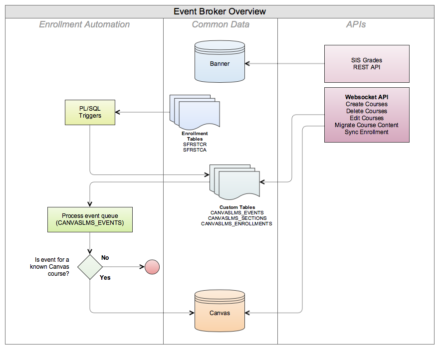

## Canvas Event Broker

### Introduction

The Canvas Event Broker is a creation of the Foothill-De Anza Community College District to link our Ellucian Banner ERP with Instructure Canvas.

Event broker goes beyond just shuttling student and course data between the two systems. Our institution has a rich history of providing a graphical user interface for _instructors_ to manage learning management integrations on their own. LMS systems have always been "opt in". To carry this vision forward into Canvas, event broker provides a websocket API, plus additional trimmings, which we use to power internal products such as a web GUI for instructors to create Canvas courses, and self-service tools that help department administrators correct problems in real-time.

### Design Notes

* Event broker communicates with Canvas exclusively using the REST API designed by Instructure. The REST API has far greater fidelity and integration into Canvas than batch CSV files, and we strongly encourage its use.
    * One exception to this is the grade submission API which receives a CSV file _from_ Canvas with final student grade entries.
* Custom tables in Banner store records about the Canvas courses instructors have created, and we keep a record of which students are currently enrolled in those courses. We use this data both to drive our automation, and for a separate GUI where instructors can view their teaching schedule in conjunction with the Canvas courses they have provisioned.
* Written in JavaScript, runs with Node.js in a Docker container

#### Overview Diagram

### Usage

There are too many things about this application unique to Foothill-De Anza, and we do not expect that other colleges can drop this into their environment and it will run. We are providing our code to the community in the spirit of collaboration and inspiration so that others can leverage our work in a variety ways when integrating a Banner ERP system with Canvas. Our code is released to you under a BSD license, please view the LICENSE file before proceeding.